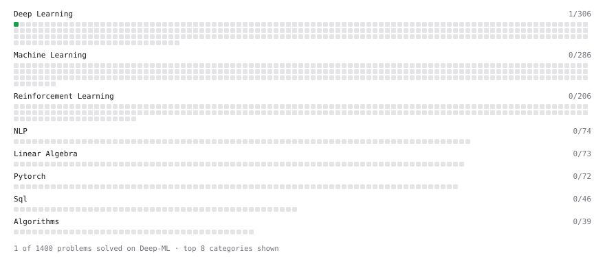

# Deep-ML

My machine learning practice from [Deep-ML](https://www.deep-ml.com). Every solution here was written by hand.

**39** solved · 39 problems · 0 labs · 0 math

[**Browse the interactive portfolio**](https://Mikel-Yu.github.io/deep-ml/) to replay this filling in over time.

## Problems

| | Difficulty | Solved | |
| --- | --- | --- | --- |
| [Build an MLP with nn.Sequential](https://www.deep-ml.com/problems/887) | easy | 2026-09-15 | [solution](problems/0887-build-an-mlp-with-nn-sequential) |
| [Calculate 2x2 Matrix Inverse](https://www.deep-ml.com/problems/8) | easy | 2026-09-11 | [solution](problems/0008-calculate-2x2-matrix-inverse) |
| [Calculate Covariance Matrix](https://www.deep-ml.com/problems/10) | easy | 2026-09-11 | [solution](problems/0010-calculate-covariance-matrix) |
| [Calculate Mean by Row or Column](https://www.deep-ml.com/problems/4) | easy | 2026-09-11 | [solution](problems/0004-calculate-mean-by-row-or-column) |
| [Calculate the Discounted Return for a Given Trajectory](https://www.deep-ml.com/problems/167) | easy | 2026-09-12 | [solution](problems/0167-calculate-the-discounted-return-for-a-given-trajectory) |
| [Compute Discounted Return](https://www.deep-ml.com/problems/165) | easy | 2026-09-12 | [solution](problems/0165-compute-discounted-return) |
| [Compute Temporal Difference Error](https://www.deep-ml.com/problems/257) | easy | 2026-09-13 | [solution](problems/0257-compute-temporal-difference-error) |
| [Derivative of a Polynomial](https://www.deep-ml.com/problems/116) | easy | 2026-09-22 | [solution](problems/0116-derivative-of-a-polynomial) |
| [Exponential Weighted Average of Rewards](https://www.deep-ml.com/problems/161) | easy | 2026-09-12 | [solution](problems/0161-exponential-weighted-average-of-rewards) |
| [Feature Scaling Implementation](https://www.deep-ml.com/problems/16) | easy | 2026-09-13 | [solution](problems/0016-feature-scaling-implementation) |
| [Group Relative Advantage for GRPO](https://www.deep-ml.com/problems/224) | easy | 2026-09-13 | [solution](problems/0224-group-relative-advantage-for-grpo) |
| [Implementation of Log Softmax Function](https://www.deep-ml.com/problems/39) | easy | 2026-09-17 | [solution](problems/0039-implementation-of-log-softmax-function) |
| [Incremental Mean for Online Reward Estimation](https://www.deep-ml.com/problems/159) | easy | 2026-09-12 | [solution](problems/0159-incremental-mean-for-online-reward-estimation) |
| [KL Divergence Estimator for GRPO](https://www.deep-ml.com/problems/225) | easy | 2026-09-14 | [solution](problems/0225-kl-divergence-estimator-for-grpo) |
| [Label Encoding for Ordinal Variables](https://www.deep-ml.com/problems/356) | easy | 2026-09-11 | [solution](problems/0356-label-encoding-for-ordinal-variables) |
| [Linear Regression Using Gradient Descent](https://www.deep-ml.com/problems/15) | easy | 2026-09-12 | [solution](problems/0015-linear-regression-using-gradient-descent) |
| [Linear Regression Using Normal Equation](https://www.deep-ml.com/problems/14) | easy | 2026-09-11 | [solution](problems/0014-linear-regression-using-normal-equation) |
| [Matrix-Vector Dot Product](https://www.deep-ml.com/problems/1) | easy | 2026-09-10 | [solution](problems/0001-matrix-vector-dot-product) |
| [Pass@k and Majority Voting Evaluation Metrics](https://www.deep-ml.com/problems/226) | easy | 2026-09-14 | [solution](problems/0226-pass-k-and-majority-voting-evaluation-metrics) |
| [Random Shuffle of Dataset](https://www.deep-ml.com/problems/29) | easy | 2026-09-20 | [solution](problems/0029-random-shuffle-of-dataset) |
| [Rejection Sampling Best-of-K Selection](https://www.deep-ml.com/problems/768) | easy | 2026-09-21 | [solution](problems/0768-rejection-sampling-best-of-k-selection) |
| [Reshape Matrix](https://www.deep-ml.com/problems/3) | easy | 2026-09-10 | [solution](problems/0003-reshape-matrix) |
| [Scalar Multiplication of a Matrix](https://www.deep-ml.com/problems/5) | easy | 2026-09-11 | [solution](problems/0005-scalar-multiplication-of-a-matrix) |
| [Sigmoid Activation Function Understanding](https://www.deep-ml.com/problems/22) | easy | 2026-09-16 | [solution](problems/0022-sigmoid-activation-function-understanding) |
| [Single Neuron](https://www.deep-ml.com/problems/24) | easy | 2026-09-16 | [solution](problems/0024-single-neuron) |
| [Softmax Activation Function Implementation ](https://www.deep-ml.com/problems/23) | easy | 2026-09-16 | [solution](problems/0023-softmax-activation-function-implementation) |
| [Transformation Matrix from Basis B to C](https://www.deep-ml.com/problems/27) | easy | 2026-09-18 | [solution](problems/0027-transformation-matrix-from-basis-b-to-c) |
| [Transpose of a Matrix](https://www.deep-ml.com/problems/2) | easy | 2026-09-10 | [solution](problems/0002-transpose-of-a-matrix) |
| [Upper Confidence Bound (UCB) Action Selection](https://www.deep-ml.com/problems/162) | easy | 2026-09-13 | [solution](problems/0162-upper-confidence-bound-ucb-action-selection) |
| [Your First Gradient with jax.grad](https://www.deep-ml.com/problems/1325) | easy | 2026-09-10 | [solution](problems/1325-your-first-gradient-with-jax-grad) |
| [Calculate Eigenvalues of a Matrix](https://www.deep-ml.com/problems/6) | medium | 2026-09-11 | [solution](problems/0006-calculate-eigenvalues-of-a-matrix) |
| [Implement K-Fold Cross-Validation](https://www.deep-ml.com/problems/18) | medium | 2026-09-22 | [solution](problems/0018-implement-k-fold-cross-validation) |
| [K-Means Clustering](https://www.deep-ml.com/problems/17) | medium | 2026-09-18 | [solution](problems/0017-k-means-clustering) |
| [Matrix times Matrix ](https://www.deep-ml.com/problems/9) | medium | 2026-09-11 | [solution](problems/0009-matrix-times-matrix) |
| [Matrix Transformation ](https://www.deep-ml.com/problems/7) | medium | 2026-09-11 | [solution](problems/0007-matrix-transformation) |
| [Mutual Information](https://www.deep-ml.com/problems/204) | medium | 2026-09-13 | [solution](problems/0204-mutual-information) |
| [Solve Linear Equations using Jacobi Method](https://www.deep-ml.com/problems/11) | medium | 2026-09-11 | [solution](problems/0011-solve-linear-equations-using-jacobi-method) |
| [Determinant of a 4x4 Matrix using Laplace's Expansion (hard)](https://www.deep-ml.com/problems/13) | hard | 2026-09-13 | [solution](problems/0013-determinant-of-a-4x4-matrix-using-laplace-s-expansion-hard) |
| [Singular Value Decomposition (SVD) of 2x2 Matrix](https://www.deep-ml.com/problems/12) | hard | 2026-09-11 | [solution](problems/0012-singular-value-decomposition-svd-of-2x2-matrix) |

---

_This file is regenerated by Deep-ML on every push._
